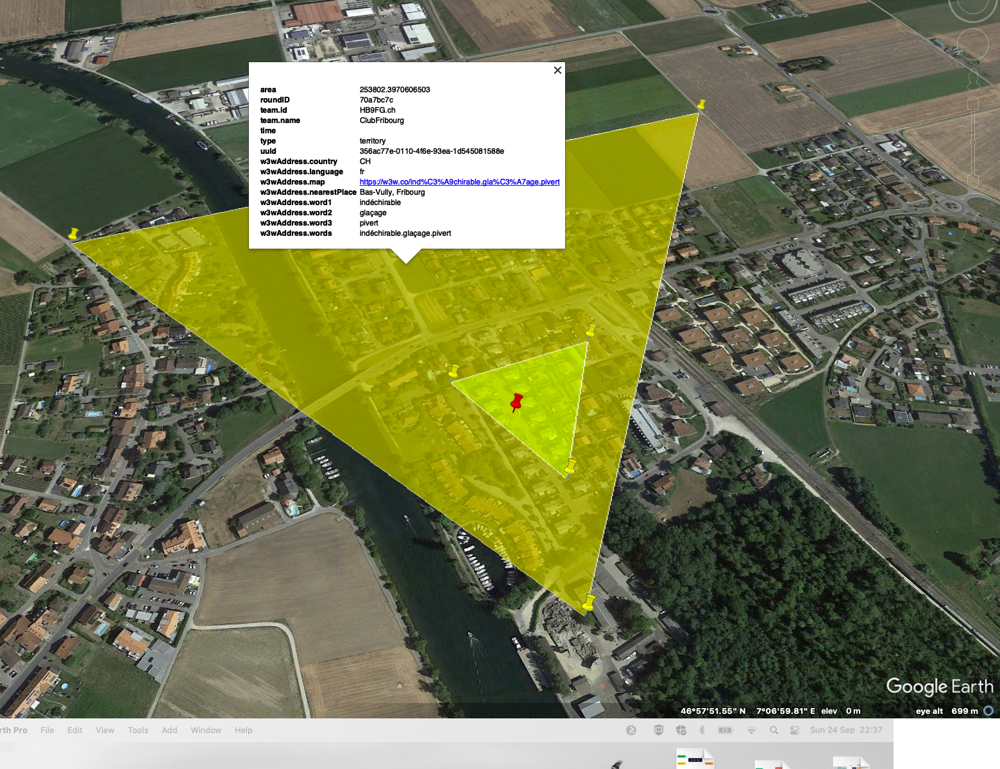

# Radio Grid Run - Introduction

## 1. Buts
Le Radio Grid Run se joue à partir d'une base de réception (ci-après [base](definitions.md#Base)) où se trouve un·e opérateur·trice (ci-après [opérateur](definitions.md#Opérateur)) qui est à l'écoute. Des équipes de 2-3 personnes (ci-après [team](definitions.md#Team) s'affrontent.

Le team qui couvre le plus grand terrain (ci-après [territoire](definitions.md#Terrain)) autour de la base par ses transmissions (ci-après [contact](definitions.md#Contact)) avec un talkie-walkie gagne la manche. Le jeu se joue en plusieurs manches.

Le territoire d'une équipe est constitué de l'espace délimité en reliant les coordonnées géographiques des positions à partir desquels celui-ci est parvenu à transmettre à la base sa position.

Les fenêtres de temps (ci-après [rendez-vous](definitions.md#Rendez-vous)) pendant lesquels la base valide les contacts sont limitées.

## 2. Principes

### Equipement :

Les appareils utilisés pour les transmissions sont des talkie-walkie (PMR446) de maximum 0,5W de puissance d'émission.

### Equipes :

Pour jouer il faut au minimum 3 équipes de 2 joueurs et un opérateur pour la *base* et un arbitre.

### Mise en place :

La base est tenu par un responsable. Les teams débutent une manche toutes en même temps depuis la base.

### Déroulement du jeu :

La manche est composée d'un certain nombre de rendez-vous entre lesquels les équipes se déplacent pour maximiser leur territoire. Après le dernier rendez-vous, les team ont un temps limité pour revenir à la base. Le jeu se termine après un débriefing formel mené par un arbitre.

Les territoires des équipes sont calculés et comparés visuellement.

